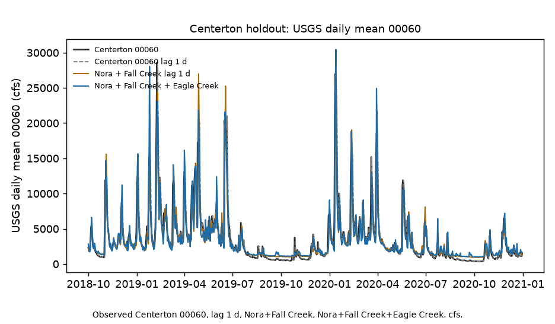
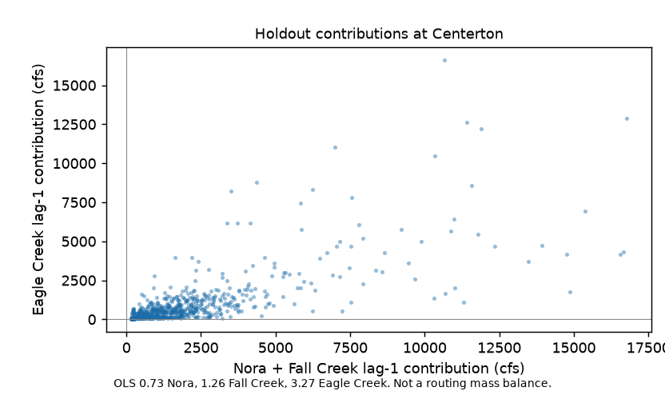

# White River Eagle Creek vs Indianapolis to Centerton gap

Does adding Eagle Creek beat Nora plus Fall Creek at Centerton?

Most days, no. Nora + Fall Creek is still closer (MAE 791 cfs vs 823 if you add Eagle Creek). On the big days, yes: adding Eagle Creek drops RMSE from 1,734 to 1,607. Persistence at Centerton is 1,795. NWM is 2,414 (`fa2e315`).

So this is not "we found the missing tributary." It is "Eagle Creek helps the peaks; it does not beat Nora + Fall Creek on a normal day."

Science lock: `8e4fdca`. The 1,734 two-feature RMSE matches `962d503` on this matrix. That tree is not restamped. This tree does not read `p_sfha`.

Eagle Creek site: **03353500** EAGLE CREEK AT INDIANAPOLIS, IN. Complete daily 00060 on 2016-10-01 to 2020-12-31. **03353451** EAGLE CREEK BELOW RESERVOIR AT INDIANAPOLIS, IN starts 2016-10-26, so it cannot fill train. **03353200** EAGLE CREEK AT ZIONSVILLE, IN has three gaps. **03353600** LITTLE EAGLE CREEK AT SPEEDWAY, IN is a different creek. Empty or late 03353500 00060 stops. No alternate site.

Indianapolis 03353000 is not a feature.

OLS weight 3.27 on Eagle Creek is not a mass-conserving pour into White River. Same honesty as Fall Creek 2.89 and Anderson 2.30. Daily 00060. No 2026. None of that flips 1,607 < 1,734, and none of it hides 823 > 791.

Cited: Anderson→Nora 971 (`58859be`). Fall Creek Indianapolis 1,265 (`962d503`). This tree does not read `p_sfha` and does not paint HAND. cfs, not feet. Do not restamp Fall Creek or NWM-error.



Figure 1. Centerton 00060, Centerton lag 1 d, Nora plus Fall Creek, Nora plus Fall Creek plus Eagle Creek. cfs. 1,607 beats 1,734 and 1,795 on RMSE.



Figure 2. Holdout OLS contributions at Centerton: Nora plus Fall Creek versus Eagle Creek. Weights 0.73, 1.26, 3.27. Not a routing mass balance.

## What was compared

| USGS site | Official name | Role |
|-----------|---------------|------|
| 03351000 | WHITE RIVER NEAR NORA, IN | Feature: daily mean **00060**, lag 1 calendar day |
| 03352500 | FALL CREEK AT MILLERSVILLE, IN | Feature: daily mean **00060**, lag 1 calendar day |
| 03353500 | EAGLE CREEK AT INDIANAPOLIS, IN | Feature: daily mean **00060**, lag 1 calendar day |
| 03354000 | WHITE RIVER NEAR CENTERTON, IN | Label. Persistence bar is this gage lag 1 d. |

00060 is USGS daily mean discharge in cfs. Not gage height 00065. Not feet. Lag is locked at 1 d. Train-only OLS. Holdout 2018-10-01 to 2020-12-31, the same split as Fall Creek, Anderson-Nora, and NWM-error.

## Live skill (holdout 2018-10-01 to 2020-12-31)

| Predictor of Centerton 00060 on day t | RMSE (cfs) | MAE (cfs) |
|---------------------------------------|-----------:|----------:|
| 0.73 * Nora + 1.26 * Fall Creek + 3.27 * Eagle Creek + 803 | 1,607 | 823 |
| Nora lag 1 d + Fall Creek lag 1 d (two-feature, matches 962d503) | 1,734 | 791 |
| Centerton 00060 lag 1 calendar day | 1,795 | 810 |
| NWM v2.1 at Centerton (cited fa2e315) | 2,414 | n/a |

## Stage 0

Synthetic Nora plus Fall Creek plus an independent Eagle Creek pulse so CI recovers an Eagle Creek coefficient without NWIS. Fixture under `logs/stage0_fixture/`.

```bash
python3.12 -m venv .venv
source .venv/bin/activate
pip install -r requirements.txt
PYTHONPATH=src:. python3 scripts/run_fixture.py logs/stage0_fixture
.venv/bin/python -m pytest tests -q
PYTHONPATH=src:. python3 scripts/run_live.py logs/nora_live
```

Two figures max. Empty or late Eagle Creek 00060 stops (`run_live.py` exit 2).

| File | Role |
|------|------|
| [METHODOLOGY.md](METHODOLOGY.md) | Locked contract |
| [AGENTS.md](AGENTS.md) | Agent rules |
| [CHECKLIST.md](CHECKLIST.md) | Operator list |
| `src/ecgap/` | NWIS 00060, lag-1 OLS, skill, figures |
| `ecgapforge/` | GraphForge pin |

Research index: https://github.com/martialsystems/.github/blob/main/RESEARCH.md
